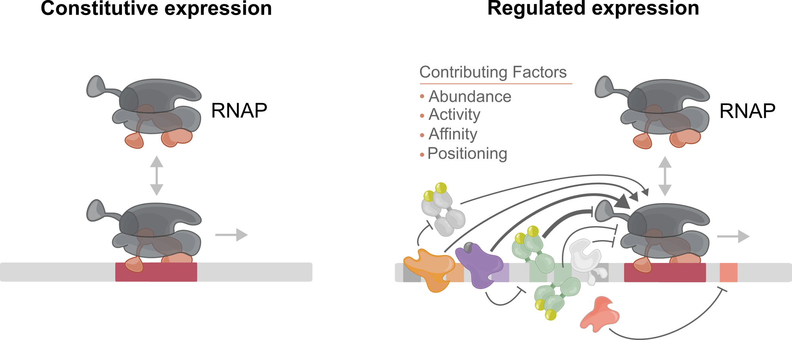
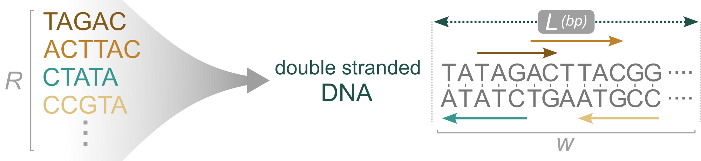
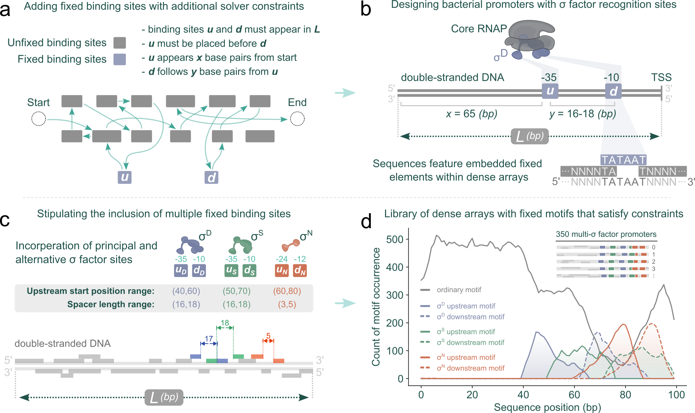

Promoters control when and how genes are transcribed. In simple constitutive
expression, RNA polymerase activity is mostly set by basal promoter strength. In
regulated expression, multiple transcription factors shape initiation by
changing binding, activity, and effective occupancy, often in a
condition-dependent way.

How do you design that kind of regulatory complexity from scratch, especially
when binding sites can overlap and compete within a short sequence?

I helped develop DensArray, a rapid in silico approach that frames this as a
nucleotide string-packing problem. The method packs many DNA–protein binding
sites into compact, contiguous arrays by reducing the search to an optimization
problem solved with integer linear programming, which makes it practical to
generate either diverse libraries or focused constructs without hand-tuning each
architecture.

We then extended the same solver with additional constraints to generate
bacterial promoter-like sequences, including fixed-position elements and
spacing rules, so the packed arrays could be used directly in promoter design
workflows.

