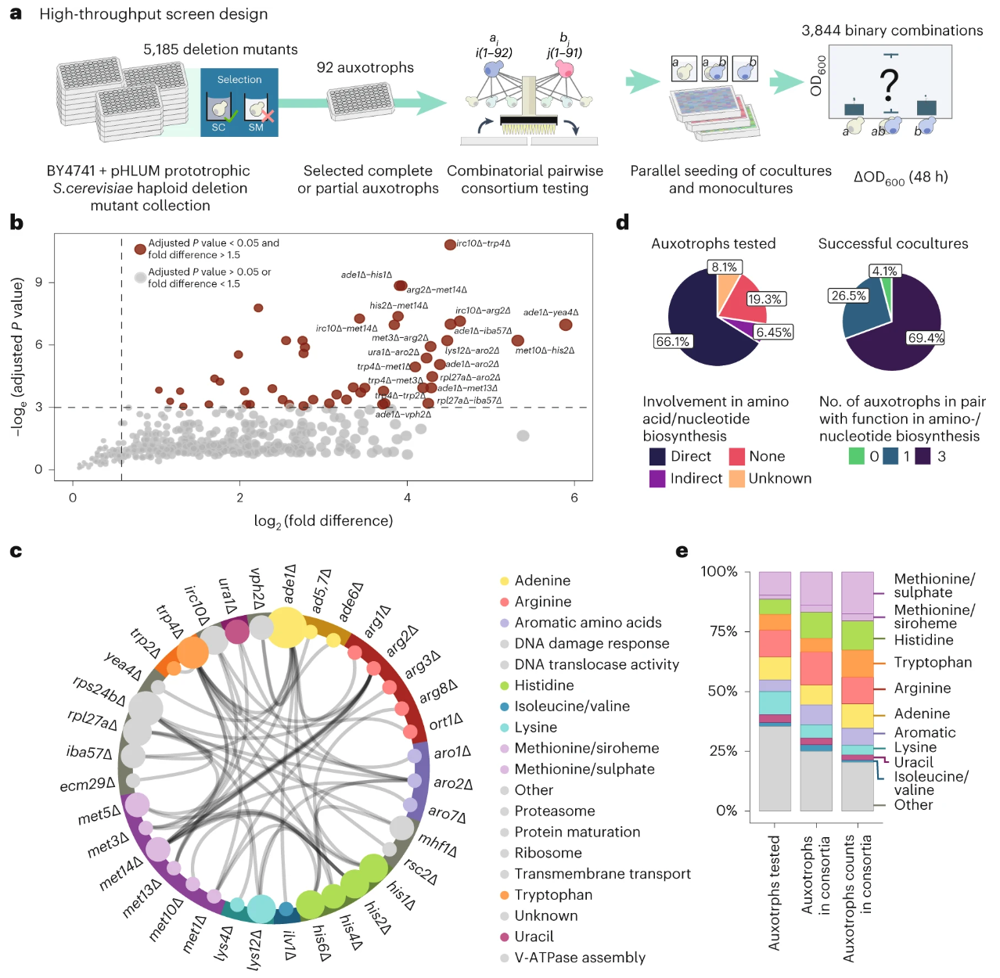

I worked with automated colony pickers and liquid handlers to run arrayed growth
experiments, including media transitions into minimal conditions and systematic
pairing of strains to expose cross-feeding and other synergistic growth
phenotypes. I paired the experimental pipeline with an R-based analysis workflow
to call hits and summarize interaction patterns. This work formed the core of my
master’s thesis and contributed to a first co-author paper in Nature Chemical
Biology.

Summary of the workflow for discovering auxotroph pairs capable of syntrophic and synergistic growth:

